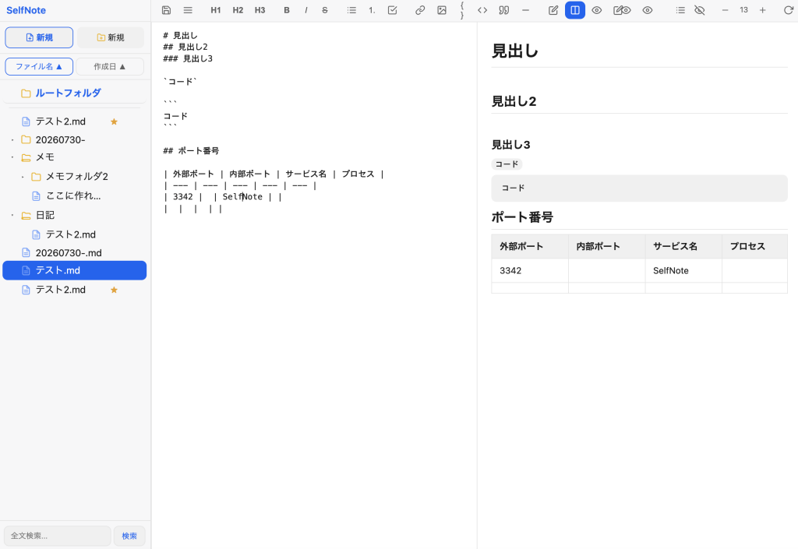

# selfnote
セルフホストで使うmdエディタです。ファイル・フォルダベースなので管理が楽。

・コンテナ内で稼働を想定

・Ubuntu26.04イメージのコンテナで動作を確認

・Tailscale環境を想定



## インストール方法

コンテナ内で下記を実行

```bash
curl -fsSL https://raw.githubusercontent.com/hirogura/selfnote/main/install-selfnote.sh | bash
```


## アンインストール方法

```bash
# 1. サービスを停止・無効化
sudo systemctl stop selfnote
sudo systemctl disable selfnote

# 2. tailscale serve の設定を解除(ポート3342)
sudo tailscale serve --https=3342 off

# 3. systemdユニットファイルを削除
sudo rm /etc/systemd/system/selfnote.service
sudo systemctl daemon-reload
sudo systemctl reset-failed

# 4. インストールディレクトリを削除
sudo rm -rf /opt/selfnote
```
### データを残すか削除するか

ノートの実体データは /opt/lxd-data/note に保存されています。これは他のサービス(/opt/lxd-data/ を共有)と混在している可能性があるので、このディレクトリはインストールディレクトリとは別に判断してください。

メモを残しておきたい場合 → 何もしない(そのまま /opt/lxd-data/note に残ります)
完全に削除したい場合:
```bash
sudo rm -rf /opt/lxd-data/note
```
